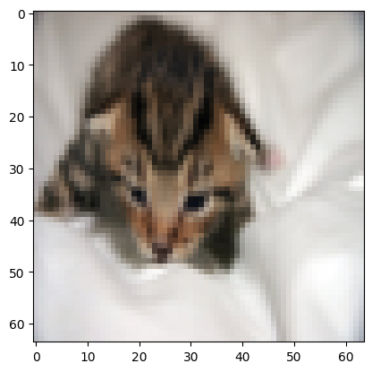
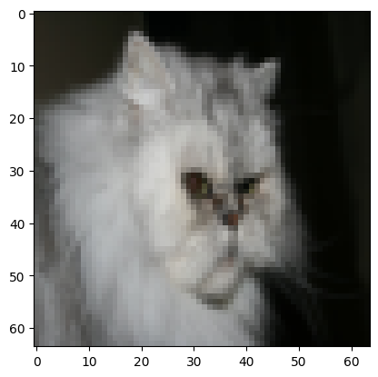
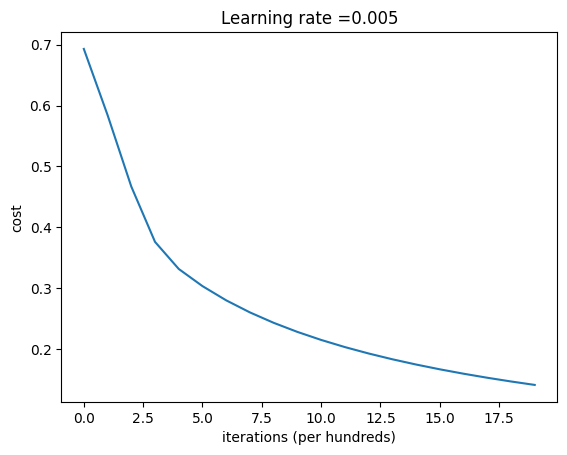

# Image Classifier for Cat Identification

In this assignment, I developed a simple image classifier to identify whether an image contains a cat with a neural network using logistic regression.

## Examples

    

        
For y = 1, you predicted that it is a "cat" picture.

        
    

    

        
For y = 1, you predicted that it is a "non-cat" picture.

        
    

## Learning Curve

    Below is the learning curve, showing how the cost function changes for each iteration:
     
    

