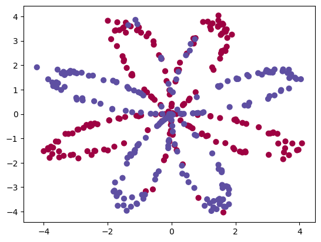
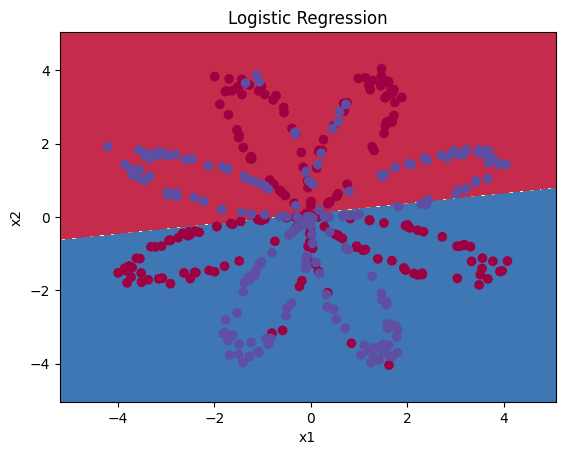
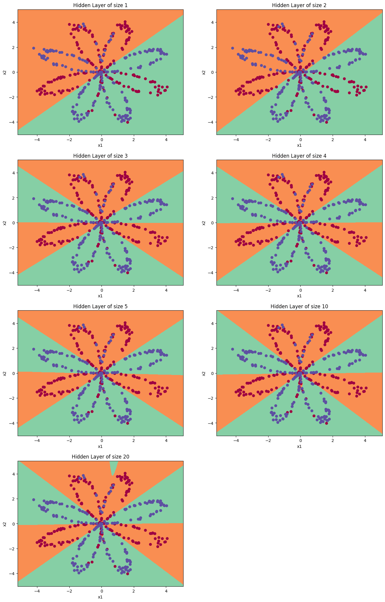

## Week 3 assignment

This week I learn how to make a neural net with 1 hidden layer

Here is the neural net architecture

And here is the input data

If using logistic regression, here is the result, which is not ideal

Here is the result of different number of hidden layer, here is the accuracy

- Accuracy for 1 hidden units: 67.5 %
- Accuracy for 2 hidden units: 67.25 %
- Accuracy for 3 hidden units: 90.75 %
- Accuracy for 4 hidden units: 90.5 %
- Accuracy for 5 hidden units: 91.25 %
- Accuracy for 10 hidden units: 90.25 %
- Accuracy for 20 hidden units: 90.5 %

